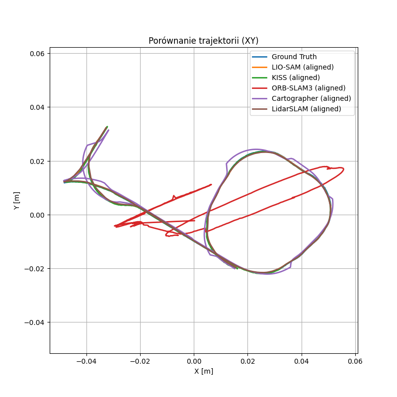
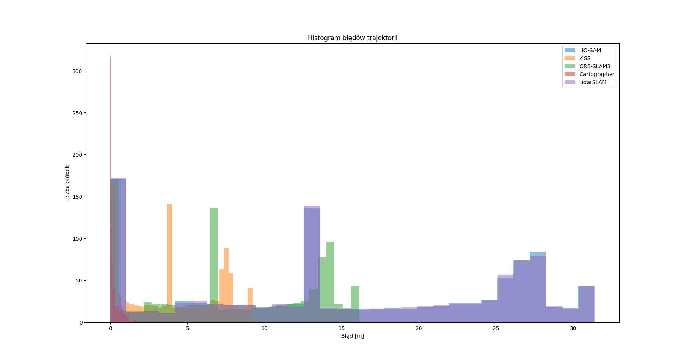

# SLAM-Benchmarks

Celem projektu realizowanego w ramach przedmiotu Autonomiczne Samochody jest przegląd dostepnych wersji SLAM (Simultaneous Localization and Mapping) wykorzystujących różne czujniki oraz porównanie dokładności trajektorii
- KISS-SLAM (dane z LiDAR)
- LIO-SAM (dane z LiDAR i IMU)
- ORBSLAM3 (dane z pojedynczej kamery RGB)
- CARTOGRAPHER (dane z LiDAR)
- LIDARSLAM-ROS2 (dane z LiDAR)

## Spis treści
- [OBRAZY-DOCKERA](#obrazy-dockera)
- [KISS-SLAM](#kiss-slam)
- [LIO-SAM](#lio-sam)
- [ORB-SLAM-3](#orb-slam-3)
- [CARTOGRAPHER](#cartographer)
- [LIDARSLAM-ROS2](#lidar-slam-ros2)
- [Wyniki](#wyniki)
- [Wnioski](#wnioski)

---
## OBRAZY-DOCKERA

W celu pobrania konkretnego obrazu Dockera należy użyć jednej z poniższych komend, a także z konkretnego SLAM'a pobrać plik .sh, który umożliwi zbudowanie kontenera <br>
<br>
LIO-SAM <pre> ```docker pull waszini/lio-sam:v1```</pre> <br>
ORB-SLAM-3 <pre> ```docker pull waszini/orbslam3:v1```</pre> <br>
CARTOGPRAHER <pre> ```docker pull div57/cartographer:v1```</pre> <br>
LIDARSLAM-ROS2 <pre> ```docker pull div57/lidarslam:v2```</pre> <br>

## KISS-SLAM
Link do literatury: https://www.ipb.uni-bonn.de/wp-content/papercite-data/pdf/kiss2025iros.pdf <br>
Link do źródła: https://github.com/PRBonn/kiss-slam <br>

**KISS-SLAM** to system SLAM oparty wyłącznie na danych z LiDAR-a, który został zaprojektowany zgodnie z zasadą „Keep It Small and Simple” (KISS). System ten zapewnia bardzo dokładne pozycjonowanie i mapowanie środowiska, osiągając wydajność porównywalną lub lepszą niż najnowocześniejsze rozwiązania SLAM, a przy tym wymaga niewielkiego lub zerowego dostrajania parametrów dla różnorodnych środowisk, sensorów i profili ruchu. Co więcej, KISS-SLAM jest w stanie operować szybciej niż częstotliwość próbkowania sensora, co czyni go praktycznym do zastosowań w świecie rzeczywistym. Jako jedyny spośród rozpatrywanych rozwiązań jest napisany jako paczka do pythona. Wystarczy wpisać <pre>```pip install kiss-slam```</pre> Do uruchomienia KISS-SLAM, służy komenda <pre>```kiss_slam_pipeline Share/rosbag2_2025_04_14-17_54_17/ --topic /sensing/lidar/concatenated/pointcloud --config KISS-SLAM/kiss_slam.yaml -v```</pre> Aby zobaczyć inne możliwe opcje należy wpisać <pre>```kiss_slam_pipeline --help```</pre>

### config.yaml

Jednym z argumentów podawanym do komendy wywołującej działanie SLAM'u jest podanie śćieżki do pliku `config.yaml`. Można go uzyskać za pomocą: <pre>```kiss_slam_dump_config```</pre> Posiada on następujące elementy:
- `out_dir` - ścieżka zapisu
- `odometry` - zawiera parametry przetwarzania wstępnego (preprocessing), rejestracji chmur punktów (registration) i podstawowego mapowania (mapping) <br>
— preprocessing: <br>
`max_range / min_range` – odfiltrowuje punkty spoza danego zakresu odległości <br>
`deskew` – jeśli true, koryguje "rozmycie" chmury punktów spowodowane ruchem robota w czasie trwania jednego skanu <br>
— registration: <br>
`max_num_iterations` – maksymalna liczba iteracji algorytmu dopasowania (np. ICP). Więcej iteracji = większa precyzja, ale wolniej <br>
`convergence_criterion` – algorytm zakończy wcześniej, jeśli poprawa dopasowania będzie mniejsza niż ta wartość <br>


<div align="center">
  <table>
    <tr>
      <td></td>
      <td></td>
    </tr>
  </table>
</div>

## LIO-SAM
Link do literatury: https://arxiv.org/pdf/2007.00258 <br>
Link do źródła: https://github.com/TixiaoShan/LIO-SAM <br>

**LIO-SAM** (Lidar Inertial Odometry via Smoothing and Mapping) to system do ściśle sprzężonej odometrii inercyjno-lidarowej, który umożliwia bardzo dokładne i w czasie rzeczywistym szacowanie trajektorii robota mobilnego oraz budowanie mapy. Opiera się on na grafie czynników, co pozwala na łatwe włączanie różnorodnych pomiarów, takich jak te z lidaru, IMU, GPS oraz pętle domknięcia, poprawiając wydajność i eliminując dryf. System ten wykorzystuje także lokalne dopasowywanie skanów i selektywne wprowadzanie kluczowych klatek, co znacząco poprawia jego wydajność w czasie rzeczywistym. <br>
Do poprawnego działania LIO-SAM należy odpowiednio skonfigurować plik `params.yaml`, który znajduje się w `/ros2_ws/src/config`. Następnie należy: <br>
- W 1 Terminalu <br> <pre> ```colcon build``` </pre>  <pre> ```source /opt/ros/humble/setup.bash``` </pre>  <pre> ```source install/setup.bash``` </pre>  <pre> ```ros2 launch lio_sam run.launch.py ``` </pre>
- W 2 Terminalu <br> <pre> ```source install/setup.bash``` </pre> <pre> ```ros2 bag play <ścieżka_do_rosbaga>``` </pre>

<div align="center">
  <table>
    <tr>
      <td></td>
      <td></td>
    </tr>
  </table>
</div>

## ORB-SLAM-3
Link do literatury: https://arxiv.org/pdf/2007.11898 <br>
Link do źródła: https://github.com/UZ-SLAMLab/ORB_SLAM3 <br>

**ORB-SLAM3** to kompleksowy, otwarty system SLAM, będący pierwszym w stanie wykonywać mapowanie wizualne, wizualno-inercyjne oraz wielo-mapowe z wykorzystaniem kamer monokularnych, stereo i RGB-D, a także modeli soczewek pin-hole i fisheye. Jego głównymi innowacjami są ciasno zintegrowany system wizualno-inercyjny oparty na estymacji Maximum-a-Posteriori (MAP), zapewniający wyjątkową dokładność i robustność, oraz system wielu map (Atlas), który dzięki ulepszonej metodzie rozpoznawania miejsc potrafi płynnie łączyć mapy i efektywnie wykorzystywać dane z poprzednich sesji, nawet po długich okresach słabych informacji wizualnych. W naszym przypadku zostało przetestowane podejście `mono` wykorzystujące kamerę RGB. <br>
Do poprawnego działania ORB-SLAM3 należy odpowiednio skonfigurować plik `PP.yaml`, który znajduje się w `arm_ws/src/orbslam_3_ros/config/monocular`. Następnie należy: <br>
- W 1 Terminalu <br> <pre> ```colcon build --symlink-install``` </pre>  <pre> ```source /opt/ros/humble/setup.bash``` </pre>  <pre> ```source install/setup.bash``` </pre>  <pre> ```ros2 run orbslam3 mono /arm_ws/src/orbslam3_ros2/vocabulary/ORBvoc.txt /arm_ws/src/orbslam3_ros2/config/monocular/PP.yaml true ``` </pre>
- W 2 Terminalu <br> <pre> ```source install/setup.bash``` </pre> <pre> ```ros2 bag play bags/rosbag2_2025_04_14-17_54_17/ --remap /pylon_stereo_node/left/image_raw:=/sensing/camera/front/image_raw --rate 0.25 -p``` </pre>

<p align="center">
  
</p>

## CARTOGRAPHER
Link do literatury: https://google-cartographer.readthedocs.io/en/latest/ <br>
Link do źródła: https://github.com/cartographer-project/cartographer <br>

**CARTOGRAPHER** to system do jednoczesnej lokalizacji i mapowania (SLAM), który w czasie rzeczywistym szacuje trajektorię robota oraz buduje mapę otoczenia. Wykorzystuje on submapy i graf optymalizacyjny, co pozwala na ściśle sprzężone dopasowywanie skanów laserowych (2D/3D), odometrii i (opcjonalnie) innych sensorów. Dzięki lokalnemu dopasowywaniu skanów i zamykaniu pętli eliminuje dryf, a elastyczna konfiguracja parametrów i wielowątkowe przetwarzanie zapewniają wysoką wydajność na platformach mobilnych. W celu poprawnego uruchomienia należy paczkę ```rosbag``` umieścić w katalogu ```/home/data```, zbudować środowisko, a następnie: </br>
- W 1 Terminalu </br> <pre> ```source install/setup.bash``` </pre> <pre> ```ros2 bag play /home/data/<nazwa_rosbag'a>``` </pre>
- W 2 Terminalu </br> <pre> ```source install/setup.bash``` </pre> <pre> ```ros2 run lidarslam lidarslam --ros-args -p set_initial_pose:=true -r /input_cloud:=/sensing/lidar/concatenated/pointcloud``` </pre>
- W 3 Terminalu </br> <pre> ```source install/setup.bash``` </pre> <pre> ```ros2 topic echo /current_pose > /home/data/traj_lidarslam.txt``` </pre>

## LIDAR-SLAM-ROS2
Link do źródła: https://github.com/rsasaki0109/lidarslam_ros2 <br>

**LIDAR-SLAM-ROS2** to pakiet ROS 2 implementujący 3D SLAM na podstawie rejestracji chmur punktów metodami NDT i GICP jako frontend oraz grafowej optymalizacji trajektorii w backendzie. Wykorzystuje przyśpieszenie OpenMP dla sekwencyjnego dopasowywania skanów, buduje submapy i optymalizuje je w grafie pozycji z obsługą zamykania pętli, co minimalizuje dryf i zapewnia dokładne, w czasie rzeczywistym estymacje trajektorii oraz mapowanie otoczenia. W celu poprawnego uruchomienia należy paczkę ```rosbag``` umieścić w katalogu ```/home/data```, a następnie: </br>
- W 1 Terminalu </br> <pre> ```source install/setup.bash``` </pre> <pre> ```ros2 bag play /home/data/<nazwa_rosbag'a>``` </pre>
- W 2 Terminalu </br> <pre> ```source install/setup.bash``` </pre> <pre> ```ros2 run cartographer_ros cartographer_node -configuration_directory /opt/ros/humble/share/cartographer_ros/configuration_files -configuration_basename backpack_2d.lua``` </pre>
- W 3 Terminalu </br> <pre> ```source install/setup.bash``` </pre> <pre> ```python3 /home/data/tf_logger.py``` </pre>

## Wyniki

Poniżej są zaprezentowane wyniki dotyczące dokładności poszczególnych SLAM'ów w porównaniu z Ground truth. Za GT wzięliśmy dane otrzymane z topicu `/sensing/gnss/gnss_transforms/rear_axis_pose`, które reprezentują pozycję pojazdu z GNSS. Rezultaty zostały otrzymane na podstawie danych znajdujących się we folderze `Wyniki`. Znajdują się tam pliki dla poszczególnych SLAM'ów oraz GT. Format plików jest następujący:
<p align="center"> t - x - y - z - qw - qy - qz - qw</p>

<div align="center">

|               | KISS-SLAM | LIO-SAM   | ORB-SLAM-3 | CARTOGRAPHER | LIDARSLAM-ROS2 |
|---------------|-----------|-----------|------------|--------------|-------------|
| RMSE [m]          | 5.3008  | 18.4349 | 9.5479   | 0.4381            | 18.4451           |
| MAE [m]           | 4.3948  | 15.2397 | 7.9029   | 0.2907            | 15.2612           |
| Max Error [m]     | 9.2144  | 31.3656 | 16.1426  | 1.6311            | 31.4287           |
| STD Error [m]     | 2.9638  | 10.3730 | 5.3578   | 0.3278            | 10.3594           |
| Median Error [m]  | 3.9376  | 13.0750 | 6.7316   | 0.1724            | 13.0645           |

</div>
<p align="center"><b>Tabela 1.</b> Porównanie SLAM'ów z Ground truth.</p>

<p align="center">
  
</p>

</div>
<p align="center"> Porównanie trajektorii</p>


<p align="center">
  
</p>

</div>
<p align="center"> Histogram błędów</p>


## Wnioski

- Rozbieżności w wynikach dla SLAM'ów korzystających z danych IMU względem GT mogą wynikać z nieprawidłowego zamontowania czujnika na pojeździe
- Spośród rozpatrywanych SLAM'ów, Cartographer wykazał się najmniejszymi błędami co wskazują wyniki przedstawione w tabeli 1 oraz histogram błędów
- Rozbieżności w trajektoriach a obliczonymi błędami mogą być spowodowane tym, że do obliczenia błędów względem ground truth wyniki ze SLAM'ów zostały przesunięte do początku układu współrzędnych (0,0,0), natomiast do wykreślenia trajektorii zastosowano dopasowanie Procrustesa, które automatycznie przesunęło i przeskalowało punkty względem ground truth
- Zniekształcona trajektoria w przypadku ORBSLAM3 wynika z użycia tylko trybu dla jednej kamery, a także tego że nagrany obraz był miejscami zbyt ciemny, przez co SLAM nie mógl znaleźć cech charakterystycznych na obrazie
- Różnice w dokładności mogą też wynikać z braku synchronizacji czasowej między czujnikami (np. kamera, IMU, LiDAR), co szczególnie dotyka algorytmy fuzji sensorycznej (LIO-SAM, ORB-SLAM3)
- Niska wartość odchylenia standardowego (STD Error) w przypadku Cartographera (0.3278 m) i KISS-SLAM (2.96 m) świadczy o stosunkowo stabilnej estymacji pozycji w czasie. Wysoka zmienność błędów dla LIO-SAM i LIDARSLAM-ROS2 sugeruje niestabilność estymatora pozycji, co może negatywnie wpłynąć na powtarzalność działania w innych przejazdach.
- Jakość danych wejściowych (np. filtrowanie szumu, kompensacja ruchu, synchronizacja czasowa) ma istotny wpływ na końcowy wynik SLAM. Brak odpowiedniego wstępnego przetwarzania może prowadzić do znacznych błędów lokalizacji, nawet w algorytmach opartych na zaawansowanych metodach fuzji sensorycznej, jak LIO-SAM.
