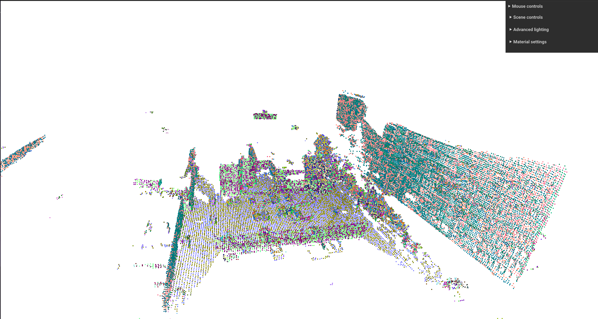
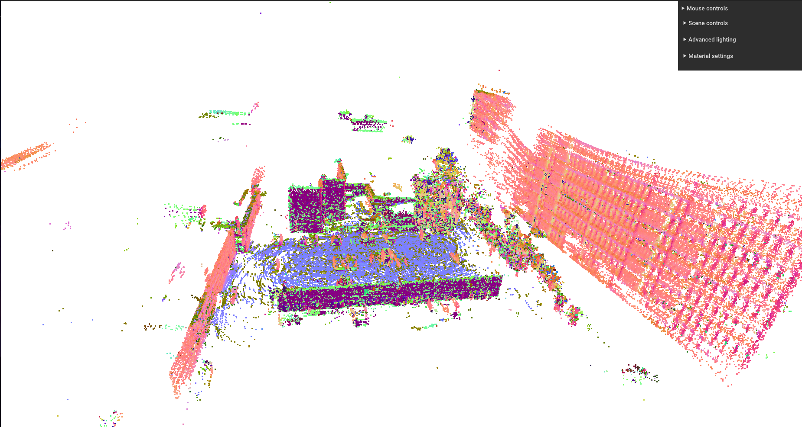

# SLAM-Benchmarks

Celem projektu realizowanego w ramach przedmiotu Autonomiczne Samochody jest przegląd dostepnych wersji SLAM (Simultaneous Localization and Mapping) wykorzystujących różne czujniki oraz porównanie dokładności trajektorii
- KISS-SLAM (dane z LiDAR)
- LIO-SAM (dane z LiDAR i IMU)
- ORBSLAM3 (dane z pojedynczej kamery RGB)
- CARTOGRAPHER ()
- FAST-SLAM 2.0 ()

## Spis treści
- [OBRAZY-DOCKERA](#obrazy-dockera)
- [KISS-SLAM](#kiss-slam)
- [LIO-SAM](#lio-sam)
- [ORB-SLAM-3](#orb-slam-3)
- [CARTOGRAPHER](#cartographer)
- [FAST-SLAM-2](#fast-slam-2)
- [Wyniki](#wyniki)
- [Wnioski](#wnioski)

---
## OBRAZY-DOCKERA

W celu pobrania konkretnego obrazu Dockera należy użyć jednej z poniższych komend, a także z konkretnego SLAM'a pobrać plik .sh, który umożliwi zbudowanie kontenera <br>
<br>
LIO-SAM <pre> ```docker pull waszini/lio-sam:v1```</pre> <br>
ORB-SLAM-3 <pre> ```docker pull waszini/orbslam3:v1```</pre> <br>
CARTOGPRAHER <pre> ```do uzupełnienia```</pre> <br>
FAST-SLAM-2 <pre> ```do uzupełnienia```</pre> <br>

## KISS-SLAM
Link do literatury: https://www.ipb.uni-bonn.de/wp-content/papercite-data/pdf/kiss2025iros.pdf <br>
Link do źródła: https://github.com/PRBonn/kiss-slam <br>

**KISS-SLAM** to system SLAM oparty wyłącznie na danych z LiDAR-a, który został zaprojektowany zgodnie z zasadą „Keep It Small and Simple” (KISS). System ten zapewnia bardzo dokładne pozycjonowanie i mapowanie środowiska, osiągając wydajność porównywalną lub lepszą niż najnowocześniejsze rozwiązania SLAM, a przy tym wymaga niewielkiego lub zerowego dostrajania parametrów dla różnorodnych środowisk, sensorów i profili ruchu. Co więcej, KISS-SLAM jest w stanie operować szybciej niż częstotliwość próbkowania sensora, co czyni go praktycznym do zastosowań w świecie rzeczywistym. Jako jedyny spośród rozpatrywanych rozwiązań jest napisany jako paczka do pythona. Wystarczy wpisać <pre>```pip install kiss-slam```</pre> Do uruchomienia KISS-SLAM, służy komenda <pre>```kiss_slam_pipeline Share/rosbag2_2025_04_14-17_54_17/ --topic /sensing/lidar/concatenated/pointcloud --config KISS-SLAM/kiss_slam.yaml -v```</pre> Aby zobaczyć inne możliwe opcje należy wpisać <pre>```kiss_slam_pipeline --help```</pre>

### config.yaml

Jednym z argumentów podawanym do komendy wywołującej działanie SLAM'u jest podanie śćieżki do pliku `config.yaml`. Można go uzyskać za pomocą: <pre>```kiss_slam_dump_config```</pre> Posiada on następujące elementy:
- wymienić co tam jest i jaki to ma wpływ na działanie oraz ogarnąć jak zrobic domykanie pętli

<div align="center">
  <table>
    <tr>
      <td></td>
      <td></td>
    </tr>
  </table>
</div>

## LIO-SAM
Link do literatury: https://arxiv.org/pdf/2007.00258 <br>
Link do źródła: https://github.com/TixiaoShan/LIO-SAM <br>

**LIO-SAM** (Lidar Inertial Odometry via Smoothing and Mapping) to system do ściśle sprzężonej odometrii inercyjno-lidarowej, który umożliwia bardzo dokładne i w czasie rzeczywistym szacowanie trajektorii robota mobilnego oraz budowanie mapy. Opiera się on na grafie czynników, co pozwala na łatwe włączanie różnorodnych pomiarów, takich jak te z lidaru, IMU, GPS oraz pętle domknięcia, poprawiając wydajność i eliminując dryf. System ten wykorzystuje także lokalne dopasowywanie skanów i selektywne wprowadzanie kluczowych klatek, co znacząco poprawia jego wydajność w czasie rzeczywistym. <br>
Do poprawnego działania LIO-SAM należy odpowiednio skonfigurować plik `params.yaml`, który znajduje się w `/ros2_ws/src/config`. Następnie należy: <br>
- W 1 Terminalu <br> <pre> ```colcon build``` </pre>  <pre> ```source /opt/ros/humble/setup.bash``` </pre>  <pre> ```source install/setup.bash``` </pre>  <pre> ```ros2 launch lio_sam run.launch.py ``` </pre>
- W 2 Terminalu <br> <pre> ```source install/setup.bash``` </pre> <pre> ```ros2 bag play <ścieżka_do_rosbaga>``` </pre>

<div align="center">
  <table>
    <tr>
      <td></td>
      <td></td>
    </tr>
  </table>
</div>

## ORB-SLAM-3
Link do literatury: https://arxiv.org/pdf/2007.11898 <br>
Link do źródła: https://github.com/UZ-SLAMLab/ORB_SLAM3 <br>

**ORB-SLAM3** to kompleksowy, otwarty system SLAM, będący pierwszym w stanie wykonywać mapowanie wizualne, wizualno-inercyjne oraz wielo-mapowe z wykorzystaniem kamer monokularnych, stereo i RGB-D, a także modeli soczewek pin-hole i fisheye. Jego głównymi innowacjami są ciasno zintegrowany system wizualno-inercyjny oparty na estymacji Maximum-a-Posteriori (MAP), zapewniający wyjątkową dokładność i robustność, oraz system wielu map (Atlas), który dzięki ulepszonej metodzie rozpoznawania miejsc potrafi płynnie łączyć mapy i efektywnie wykorzystywać dane z poprzednich sesji, nawet po długich okresach słabych informacji wizualnych. W naszym przypadku zostało przetestowane podejście `mono` wykorzystujące kamerę RGB. <br>
Do poprawnego działania ORB-SLAM3 należy odpowiednio skonfigurować plik `PP.yaml`, który znajduje się w `arm_ws/src/orbslam_3_ros/config/monocular`. Następnie należy: <br>
- W 1 Terminalu <br> <pre> ```colcon build --symlink-install``` </pre>  <pre> ```source /opt/ros/humble/setup.bash``` </pre>  <pre> ```source install/setup.bash``` </pre>  <pre> ```ros2 run orbslam3 mono /arm_ws/src/orbslam3_ros2/vocabulary/ORBvoc.txt /arm_ws/src/orbslam3_ros2/config/monocular/PP.yaml true ``` </pre>
- W 2 Terminalu <br> <pre> ```source install/setup.bash``` </pre> <pre> ```ros2 bag play bags/rosbag2_2025_04_14-17_54_17/ --remap /pylon_stereo_node/left/image_raw:=/sensing/camera/front/image_raw --rate 0.25 -p``` </pre>

<p align="center">
  
</p>

## CARTOGRAPHER
Link do literatury: https://google-cartographer.readthedocs.io/en/latest/ <br>
Link do źródła: https://github.com/cartographer-project/cartographer <br>

## FAST-SLAM-2
Link do literatury: https://robots.stanford.edu/papers/Montemerlo03a.pdf <br>
Link do źródła: https://github.com/yingkunwu/FastSLAM <br>

## Wyniki

Poniżej są zaprezentowane wyniki dotyczące dokładności poszczególnych SLAM'ów w porównaniu z Ground truth. Za GT wzięliśmy dane otrzymane z topicu `/tf`, które reprezentują pozycję pojazdu ale otrzymaną dzięki EKF (Rozszerzony Filtr Kalmana). Rezultaty zostały otrzymane na podstawie danych znajdujących się we folderze `Wyniki`. Znajdują się tam pliki dla poszczególnych SLAM'ów oraz GT. Format plików jest następujący:
<p align="center"> t - x - y - z - qw - qy - qz - qw</p>

<div align="center">

|               | KISS-SLAM | LIO-SAM   | ORB-SLAM-3 | CARTOGRAPHER | FAST-SLAM-2 |
|---------------|-----------|-----------|------------|--------------|-------------|
| RMSE          | 5.4967 m  | 19.0004 m | 9.9475 m   | -            | -           |
| MAE           | 4.6551 m  | 15.9962 m | 8.3742 m   | -            | -           |
| Max Error     | 9.8091 m  | 31.8136 m | 16.7721 m  | -            | -           |
| STD Error     | 2.9230 m  | 10.2537 m | 5.3691 m   | -            | -           |
| Median Error  | 4.2390 m  | 14.3596 m | 7.4455 m   | -            | -           |

</div>
<p align="center"><b>Tabela 1.</b> Porównanie SLAM'ów z Ground truth.</p>

WSTAWIĆ JESZCZE HISTOGRAM BŁĘDÓW ORAZ TRAJEKTORIE!!!!!!!!!!!!!!!!!!

## Wnioski

- rozbieżności w wynikach dla SLAM'ów korzystających z danych IMU względem GT mogą wynikać z nieprawidłowego zamontowania czujnika na pojeździe
- rozbieżności w wynikach, zwłaszcza w wykresie przedstawiąjącym trajektorie względem GT wynikają z dryfu podczas liczenia EKF dla `/tf`, stąd pojawiają się charakterystyczne "fale"
- dopisać resztę potem
